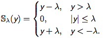

title: Exercises
date: 2016-04-26 
tags: [Machine Learning, Coordinate Descent, BFGS, Exercises]
categories: [Machine Learning, Exercise]
description: 本文是对前面涉及到的算法的实践。
<!--mathjax: true-->
---

## Part I : Data Preprocessing
在实际数据中，我们总会遇到类别变量(category variables)。对于这种变量，它是没有数值意义上大小的，我们要用dummy coding来编码，然后再来处理。常用的dummy coding方法：对于有n种类别的类别变量，我们用n-1位数来编码。(例如：有四个类别种类的变量，我们用000，001，010，100来编码)。在实际数据中，经常也会出现数据缺失的情况，在这里我是用该属性(attribute)的均值来填充的(当然也可以用其他的办法来解决：比如删除有缺失属性的样本，或者将缺失的属性作为一个新的类别等).


## Part II: Linear Regression and Stochastic Gradient Descent (SGD)

这一部分主要贴下minibatch-SGD的实现，关于Linear Regression的实现已经在前几篇博客中提过了。

```matlab
function [paraTheta,cost] = sgd(theta0,X,y)

epochs = 50;
minibatch = 256;
m = size(X,1);
alpha = 0.001;

paraTheta = theta0;

for i = 1: epochs
	rp = randperm(m);
	
	for j = 1 : minibatch : (m - minibatch + 1)
		x1 = X(rp(j:j+minibatch-1)',:);
		y1 = y(rp(j:j+minibatch-1)');
		[cost,gradient] = linearRegressionCost(paraTheta,x1,y1);
		paraTheta = paraTheta - alpha*gradient;
	end
	
	alpha = alpha/2.0;
cost = 0.5*norm(X*paraTheta-y);
end
end
```

```matlab
function [cost, gradient] = linearRegressionCost(theta,X,y)
 cost = 0.5*norm(X*theta-y,2);
 gradient = X'*(X*theta - y);
end
```

## Part III: Overfitting and Regularization for Regression

当我们对模型参数加了L1 norm约束之后(LASSO)，模型的优化目标不再是在全部点处可导，这时basic gradient descent的方法就不再可行了。关于LASSO的一阶最优条件，在 [Linear Models for Regression](http://frankchu0229.github.io/2016/04/12/ML4/)这篇博客中已经提过了。常用的求解LASSO的方法有：迭代软阈值算法(IST), 最小角回归(LARS), 坐标下降法(coordinate descent), ADMM 等。

### 迭代软阈值算法(IST)

在linear regression中，我们的优化目标为\\(E\_{in} = \frac{1}{2} ||\mathbf{X}\theta - \mathbf{y}||\_2^2 + \lambda||\theta||\_{1} = f(\theta) + \lambda||\theta||\_{1}\\). 

IST算法：在点\\(\theta\\)处，$$ Q(z,\theta) = f(\theta) + \nabla f(\theta)^T(z - \theta) + \frac{1}{2}||z - \theta||\_2^2$$ 是对\\(f(z)\\)的二阶近似。现在考虑我们的L1约束问题：\\(\min\_{\theta}  f(\theta) + \lambda||\theta||\_{1} \\)，对第k次迭代，IST用local的\\(Q(z,\theta\_{k}) + \lambda ||z||\_1\\)来代替：\\( f(\theta) + \lambda||\theta||\_{1} \\). 这样有：
$$\theta\_{k+1} = arg \min\_{z} Q(z,\theta\_{k}) + \lambda ||z||\_1 $$

\\(\theta\_{k+1}\\)的解的形式可以用软阈值算子来写出：\\(\theta\_{k+1} = S\_{\lambda}(\theta\_{k} - \nabla f(\theta\_{k}^T)) = S\_{\lambda}(\theta\_{k} - \mathbf{X}^T(\mathbf{X}\theta\_{k} - \mathbf{y})\\). 其中，
<div  align="center">    

</div>

关于软阈值算子的实现：

```matlab
function y = soft(x,tau)
%This is the soft-thresholding operator
y = sign(x).*max(abs(x)-tau,0);
```

总结：IST是一种迭代优化的方法，对于第k次迭代\\(\theta\_k\\), IST对目标函数在\\(\theta\_k\\)处进行展开，用目标函数的二阶近似来代替该目标函数；通过求解该二阶近似函数来得出第k+1次迭代\\(\theta\_{k+1}\\)的值。

### 坐标下降法 (Coordinate Descent)

Coordinate descent (CD)是一种常用的求解模型参数的方法。在每一次迭代中，CD不是沿着参数梯度方向进行搜索，而是沿着坐标方向进行搜索。对于有n个参数的linear regression问题，CD在每一次迭代中沿着一个坐标方向去搜索，通过循环使用不同坐标方向来达到目标函数的局部最小值。

\\(E\_{in} = \frac{1}{2} ||\mathbf{X}\theta - \mathbf{y}||\_2^2 + \lambda||\theta||\_{1} = f(\theta) + \lambda||\theta||\_{1}\\). 

对第i个坐标方向进行最小化,得到一阶最优条件：
$$\mathbf{X}^T\_{i}(\mathbf{X}\theta - \mathbf{y}) + \lambda s\_i = \mathbf{X}^T\_{i} \mathbf{X}\_i \theta\_i + \mathbf{X}^T\_{i}\mathbf{X}\{-i}\theta\_{-i} - \mathbf{X}^T\_{i}\mathbf{y} +  \lambda s\_i  = 0 $$

其中，\\(\mathbf{X}\_i \\)表示 \\(\mathbf{X}\\)的第i列，\\(\mathbf{X}\_{-i} \\)表示\\(\mathbf{X}\\)除去第i列，\\(s\_i\\)表示次梯度。

通过以上一阶最优条件解得：

$$\theta\_i = S\_{\lambda / ||\mathbf{X}\_i||_2^2}(\frac{\mathbf{X}\_i^T (\mathbf{y} - \mathbf{X}\{-i}\theta\_{-i})}{\mathbf{X}\_i^T \mathbf{X}\_i})$$

其中，\\(i = 1,2,...n\\), S为软阈值算子。

当目标函数为光滑的时候，CD通过沿着不同坐标方向不断迭代，可以收敛到局部极小值或者驻点；当目标函数不光滑的时候，CD可能会收敛到非驻点(non-stationary point).

下面是对Linear Regression问题的CD解法。


```matlab
function [paraTheta, cost] = cdCost(theta0,X,y,lambda)

theta = theta0;
epochs = 50;
n = size(X,2);
optTol = 0.0001;

for i = 1: epochs
theta_old = theta;
for j = 1:n 
	theta(j) = softThreshold(j,theta,X,y,lambda);
end

cost = 0.5*norm(X*theta-y) + lambda*norm(theta,1)
%% checking convergence:
if sum(abs(theta-theta_old))/sum(abs(theta)) < optTol
	break;
end

end
paraTheta = theta;
end
```

```matlab
function [thetai] = softThreshold(i,theta,X,y,lambda)
Xt = X';
a = Xt(i,:)*y;
c = X*theta - X(:,i)*theta(i);
b = Xt(i,:)*c;
den = Xt(i,:)*X(:,i);

if(a-b > lambda)
	thetai = (a-b-lambda) / den;

elseif(a-b < -lambda)
	thetai = (a-b+lambda) / den;
else
	thetai = 0;

end
```

## Part IV: Classification 

 关于Logistic Regression model的实现已经在[Linear Models for Classification](http://frankchu0229.github.io/2016/04/24/ML5/)这篇博客中提过了 (用了gradient descent，Newton method，BFGS 和 l-BFGS(minfunc)四个优化方法来实现)。
 

# Reference

- Book: [Pattern Recognition and Machine Learning by Christopher Bishop](prml)
- [Notes of machine learning by Andrew Ng in cousera](http://www.holehouse.org/mlclass)
- [机器学习][url1] 周志华
- Slides by [Prof. Wang](http://sist.shanghaitech.edu.cn/StaffDetail.asp?id=334)
- [统计学习方法](http://www.hangli-hl.com/books.html)
- [Coordinate Descent](https://www.cs.cmu.edu/~ggordon/10725-F12/slides/25-coord-desc.pdf)


[url1]:http://cs.nju.edu.cn/zhouzh/zhouzh.files/publication/MLbook2016.htm
[prml]:http://www.rmki.kfki.hu/~banmi/elte/Bishop%20-%20Pattern%20Recognition%20and%20Machine%20Learning.pdf


<script type="text/javascript" src="http://cdn.mathjax.org/mathjax/latest/MathJax.js?config=default"></script>

<!--<div  align="center">    

</div>-->
